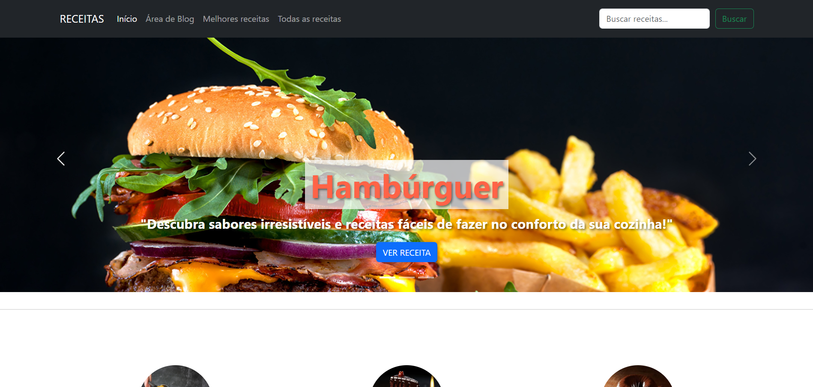
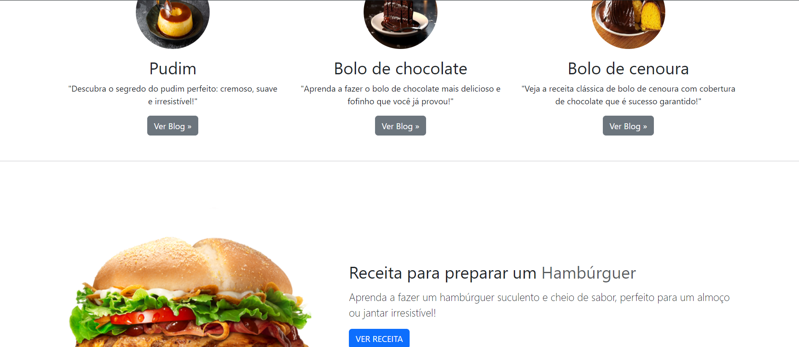
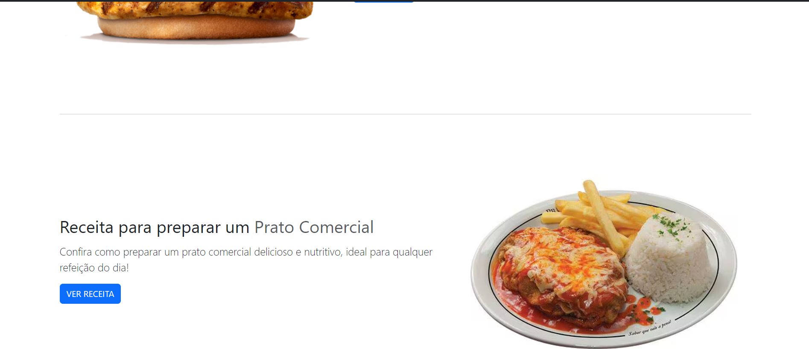

# 💡 Projeto de Receitas

Um site de receitas interativo que permite aos usuários pesquisar e explorar diversas receitas de maneira organizada e visualmente atraente.

__Você pode ver esse projeto bem [Aqui](https://www.seuSite.com.br)__

 🖥️ Versão web                                                   
:----------:                                                     
   



## ⚙️ Funcionalidades

- ✅ Design Responsivo
- ☑️ Busca de receitas
- ✅ Organização de receitas por categoria
- ☑️ Modal de receita não encontrada
- ✅ Blog com dicas de receitas
- ☑️ Barra de navegação fixa

## 🧰 Bibliotecas

- ✅ Bootstrap: usado para a responsividade e design
- ☑️ jQuery: manipulação de DOM e eventos
- ✅ FontAwesome: ícones
- ☑️ Bootstrap Modal: modal para notificação de receita não encontrada

## ⬇️ Rodando o projeto

1. Clone o repositório
2. Abra o terminal e navegue até o diretório do projeto
3. Instale as dependências necessárias
4. Abra o arquivo `index.html` em um navegador que esta na pasta html
5. ```
   git clone https://github.com/seuUsuario/seuRepositorio.git
   cd seuRepositorio
## 🧩 Tecnologias Utilizadas
<div align="left">
  
  
  
  
  
  
  
</div>

## ⌛ Status do projeto
- [x] Estrutura HTML das páginas
- [x] Design responsivo com CSS e Bootstrap
- [x] Implementação da barra de busca
- [x] Modal de receita não encontrada
- [ ] Integração com banco de dados para receitas dinâmicas


